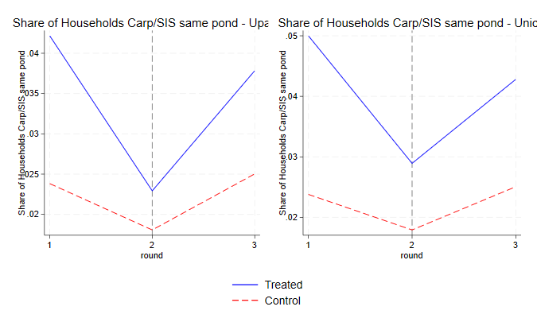

## Suchana's effect on the Production of Nutrient-rich SIS 
 

{: .note-title }
> Small Indigenous Species: A CGIAR-Led Revival
>
> Small indigenous species (SIS) are a naturally occurring dietary staple in Bangladesh. However, with the rise of commercial aquaculture, SIS populations declined significantly as farmers increasingly "cleaned" their ponds with pesticides. This practice, based on the belief that small, lower-yielding native fish competed with more marketable species like carp and tilapia, led to the widespread loss of SIS.
> 
> WorldFish has worked to dismantle this misconception, pioneering the promotion of carp-tilapia-SIS polyculture to enhance both productivity and nutrition. Since 2011, it has been implementing this approach through smaller projects like IDEA and ANEP. However, these initiatives remained limited in scale, each reaching fewer than 2,000 households across different divisions.

Suchana (2016-2023) was a large-scale project in the Sylhet division focusing on multiple nutrition interventions. It reached 250,000 households over 7 years, with at least 75,000 of these also getting the aquaculture-related interventions, which were delivered by WorldFish. 
The interventions included:
-  Encouraging the production of SIS;
-  Encouraging the production of dried fish;
-  Disseminating carp-tilapia-SIS polyculture systems;
-  Encouraging the usage of improved management practices

 
 

  

    

      <h4>2012</h4>
      
BIHS R1

    

  

  

    

      <h4>2015</h4>
      
BIHS R2

    

  

  

    

      <h4>2016</h4>
      
Suchana starts in the original locations

    

  

  

    

      <h4>2018</h4>
      
BIHS R3

    

  

  

    

      <h4>2020</h4>
      
Suchana starts in replication areas

    

  

  

    

      <h4>2022</h4>
      
End of original activities (December)

    

  

  

    

      <h4>2023</h4>
      
End of replication activities

    

  

  

    

      <h4>2024</h4>
      
BIHS R4

    

  

 
 

## Suchana in the BIHS

Suchana was implemented at the Union level (smallest possible admin unit). However, many of these unions are not present in the BIHS. If one considers that the entire Upazila was treated once a union inside it received the intervention (which would make sense because of spillovers), we get a bit more power. I ran the exploratory analyses both ways. Results are pretty similar in magnitude and direction, but the ones for Upazilla-level treatment are more significant. 

|                        | Wave 1 (2012) | Wave 2 (2015) | Wave 3 (2018) | Wave 4 (2024)          |
|------------------------|--------------|--------------|--------------|------------------------|
| **Treated Unions (total)** | 0            | 0            | 78           | 157 + 26 (replication) |
| **Treated Unions (BIHS)**  | 0            | 0            | 12           | 18                     |
| **# Treated households (BIHS)** - Union level treatment | 0            | 0            | 257          | 390*                   |
| **# Treated households (BIHS)** - Upazila level treatment| 0            | 0            | 370         | 449*                   |
| **All households (BIHS)**  | 6,503        | 6,436        | 5,604        | ?                      |

*Based on the number of households in those unions in R3

### Treatment at the Union level
<iframe src="suchana_unions" height="400" width="560"> Suchana Intervention Areas </iframe>

### Treatment at the Upazila level
<iframe src="suchana_upazilla" height="400" width="560"> Suchana Intervention Areas </iframe>

 
 

## Observable Characteristics 

- Carps, tilapia, SIS cultivated in the same pond
- Dried small fish (production and consumption)
- More harvests per pond
- Tilapia and Carps ponds more productive (?)
- Mothers thinking it is OK to feed small fish to their young children (no way of checking this with the DiD - R1 is missing)
- GIFT tilapia and G3 rohu (no way of checking this with the DiD)

 
 

## Exploratory Analysis

For now I am only using rounds 1, 2 and 3 of the BIHS (because I don't have access to the latest round). So instead of a staggered event study I am doing a TWFE, and considering the blue unions (treated between 2016 and 2018) as treatment.

### Parallel trends

 

### TWFE Preliminary Results

### Treatment at Union Level (likely underpowered for R3)

| Union-level Treatment | (1) Produce SIS | (2) Produce Mola | (3) Consumes SIS | (4) Consumes Dry SIS | (5) Average Harvest per Pond (kg) | (6) Number of Harvest | (7) Avg Spent on Feed/kg Harvest (Carp Ponds) | (8) Carp-SIS Polyculture |
|----------------------|--------------|--------------|--------------|--------------|------------------------------|-------------------|---------------------------------|----------------------|
| **Treated x Round 3** | 0.095 | 0.21*** | 0.028 | 0.047 | -63.42 | 14.46*** | -80.5* | -0.016 |
|                      | (0.067) | (0.0468) | (0.0349) | (0.034) | (69.7) | (3.35) | (48.7) | (0.114) |
| **Individual FE**    | Yes | Yes | Yes | Yes | Yes | Yes | Yes | Yes |
| **Time FE**         | Yes | Yes | Yes | Yes | Yes | Yes | Yes | Yes |
| **Observations**    | 4,104 | 4,104 | 17,475 | 17,475 | 2,425 | 2,439 | 2,075 | 2,439 |
| **R²**             | 0.6439 | 0.4468 | 0.4828 | 0.517 | 0.5011 | 0.4633 | 0.3922 | 0.4351 |

Standard errors are clustered at the union level.

### Treatment at Upazila Level

| Upazilla-level Treatment | (1) Produce SIS | (2) Produce Mola | (3) Consumes SIS | (4) Consumes Dry SIS | (5) Average Harvest per Pond (kg) | (6) Number of Harvest | (7) Avg Spent on Feed/kg Harvest (Carp Ponds) | (8) Carp-SIS Polyculture |
|----------------------|--------------|--------------|--------------|--------------|------------------------------|-------------------|---------------------------------|----------------------|
| **Treated x Round 3** | 0.08* | 0.222*** | 0.078** | 0.09*** | -67.19 | 11.91*** | -84.5* | -0.036 |
|                      | (0.049) | (0.053) | (0.038) | (0.034) | (70.4) | (3.583) | (49.3) | (0.0935) |
| **Individual FE**    | Yes | Yes | Yes | Yes | Yes | Yes | Yes | Yes |
| **Time FE**         | Yes | Yes | Yes | Yes | Yes | Yes | Yes | Yes |
| **Observations**    | 4,104 | 4,104 | 17,475 | 17,475 | 2,425 | 2,439 | 2,075 | 2,439 |
| **R²**             | 0.6439 | 0.4492 | 0.4831 | 0.5174 | 0.5011 | 0.4631 | 0.3922 | 0.435 |

Standard errors are clustered at the union level. Clustering at upazila level does not change much (it just becomes more significant). But I chose to keep it at union level since actual treatment delivery by Worldfish was at union level.

 
 



